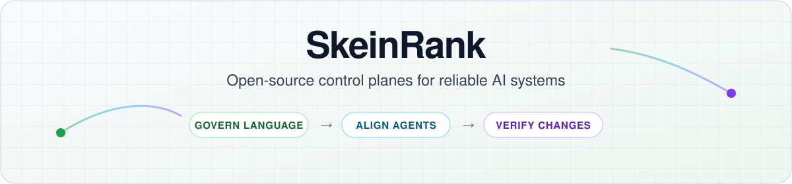
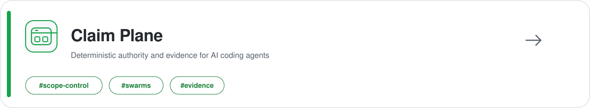
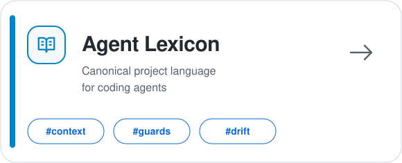
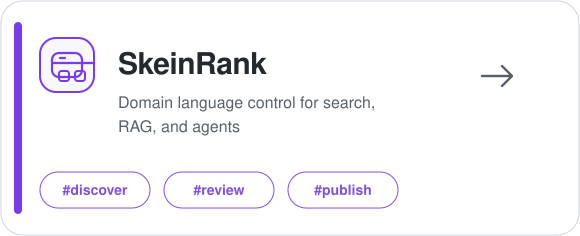

  <picture>
    <source media="(prefers-color-scheme: dark)" srcset="./assets/hero-dark.svg">
    
  </picture>

  <a href="https://skeinrank.github.io/"><strong>Website</strong></a> ·
  <a href="https://github.com/SkeinRank/claim-plane"><strong>Claim Plane</strong></a> ·
  <a href="https://github.com/orgs/SkeinRank/discussions"><strong>Discussions</strong></a> ·
  <a href="https://github.com/SkeinRank?tab=repositories"><strong>All repositories</strong></a>

  Open-source control planes for reliable AI systems: govern language, align agent behavior, and verify software changes.

## Featured projects

<a href="https://github.com/SkeinRank/claim-plane">
  <picture>
    <source media="(prefers-color-scheme: dark)" srcset="./assets/claim-plane-dark.svg">
    
  </picture>
</a>

  
  
  

Deterministic authority, controlled scope expansion, managed execution, and auditable evidence for AI coding agents.

<table>
  <tr>
    <td width="50%" valign="top">
      <a href="https://github.com/SkeinRank/agent-lexicon">
        <picture>
          <source media="(prefers-color-scheme: dark)" srcset="./assets/agent-lexicon-dark.svg">
          
        </picture>
      </a>
       
      
      
        
      Canonical project vocabulary and merge-time drift detection for coding agents.
    </td>
    <td width="50%" valign="top">
      <a href="https://github.com/SkeinRank/skeinrank">
        <picture>
          <source media="(prefers-color-scheme: dark)" srcset="./assets/skeinrank-dark.svg">
          
        </picture>
      </a>
       
      
      
        
      Domain language control for search, RAG, runtime text, and agent workflows.
    </td>
  </tr>
</table>

  <strong>Govern meaning</strong> → <strong>align agent language</strong> → <strong>control code changes</strong> 
  Each project is independently usable, but together they form a coherent reliability stack.

## Start here

<table>
  <tr>
    <td width="34%" valign="top">
      <strong>Claim Plane</strong> 
      <code>pip install claim-plane</code>  
      Explicit change authority, controlled scope expansion, managed execution, and auditable evidence.
    </td>
    <td width="33%" valign="top">
      <strong>Agent Lexicon</strong> 
      <code>pipx install agent-lexicon</code>  
      Give coding agents canonical project vocabulary and detect naming drift before merge.
    </td>
    <td width="33%" valign="top">
      <strong>SkeinRank</strong> 
      <code>pip install skeinrank</code>  
      Discover terminology, review evidence, publish dictionaries, and canonicalize runtime text.
    </td>
  </tr>
</table>

## Evidence and benchmarks

- **[Claim Plane](https://github.com/SkeinRank/claim-plane)** — reproducible CooperBench experiments, open research artifacts, and the Claim Plane papers.
- **[Agent Lexicon benchmark](https://github.com/SkeinRank/agent-lexicon-benchmark)** — paired-run evidence for terminology control in coding agents.
- **[SkeinRank benchmark](https://github.com/SkeinRank/skeinrank-benchmark)** — reproducible search and reranking benchmark outputs.
- **[OSS Drift Report](https://github.com/SkeinRank/oss-drift-report)** — terminology drift measurements on real open-source repositories.

## Repository map

| Repository | Purpose |
| --- | --- |
| [claim-plane](https://github.com/SkeinRank/claim-plane) | Control plane for verifiable AI engineering and agent-generated code changes. |
| [agent-lexicon](https://github.com/SkeinRank/agent-lexicon) | Deterministic terminology layer for coding agents. |
| [skeinrank](https://github.com/SkeinRank/skeinrank) | Domain language control plane for search, RAG, and agent workflows. |
| [agent-lexicon-benchmark](https://github.com/SkeinRank/agent-lexicon-benchmark) | Public benchmark runs and outputs for Agent Lexicon. |
| [skeinrank-benchmark](https://github.com/SkeinRank/skeinrank-benchmark) | Public benchmark runs and outputs for SkeinRank. |
| [oss-drift-report](https://github.com/SkeinRank/oss-drift-report) | Reproducible terminology drift measurements. |
| [skeinrank.github.io](https://github.com/SkeinRank/skeinrank.github.io) | Documentation site and project landing pages. |
| [.github](https://github.com/SkeinRank/.github) | Organization profile and shared community defaults. |

  Deterministic where possible · Human-reviewed where meaning changes · Evidence before rollout · Built beside existing infrastructure

